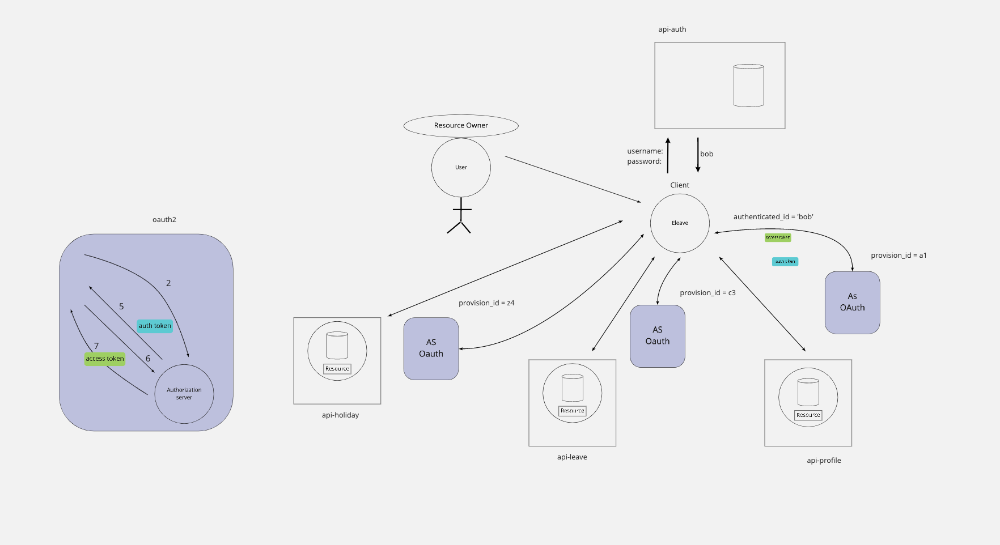
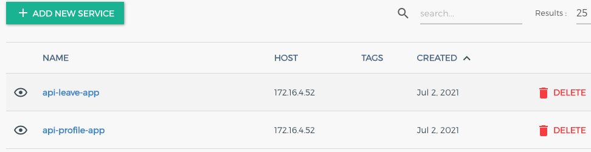
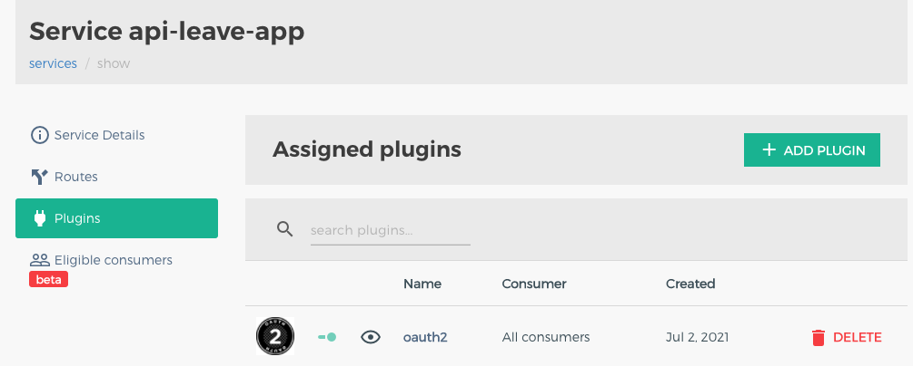
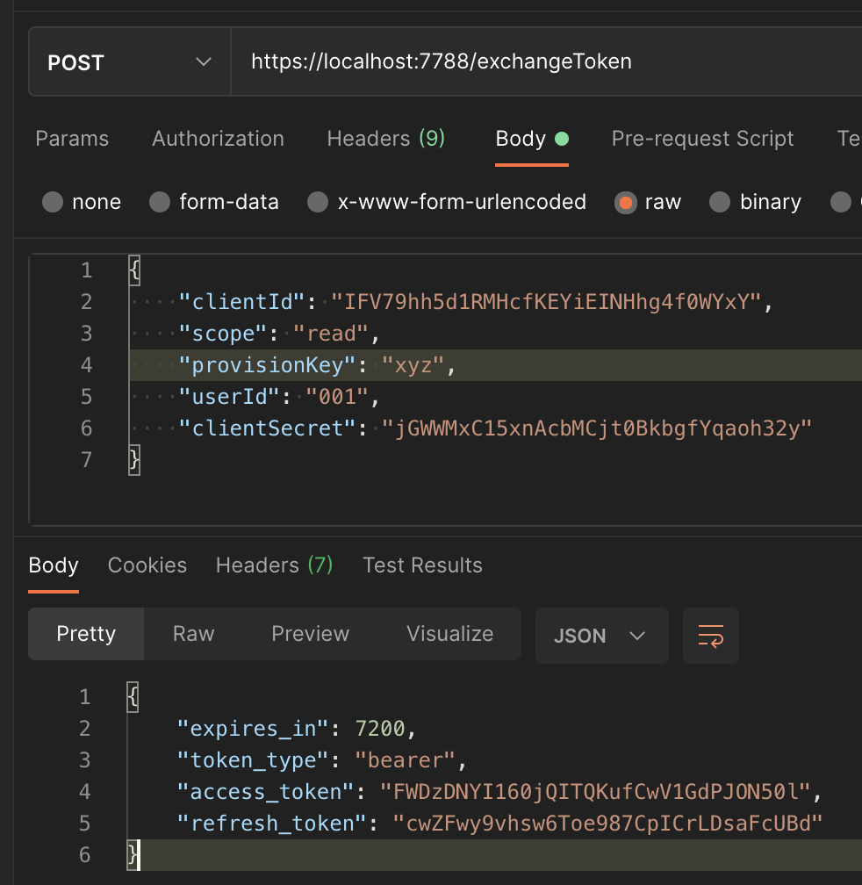
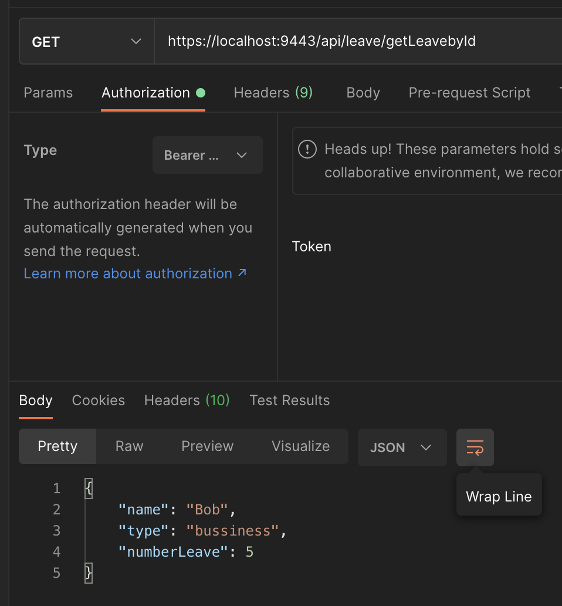
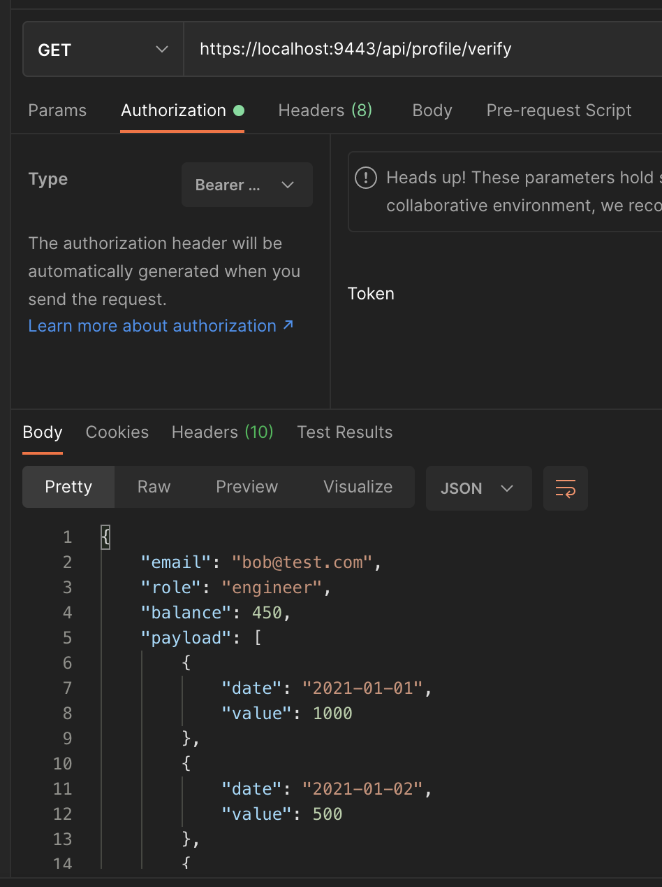
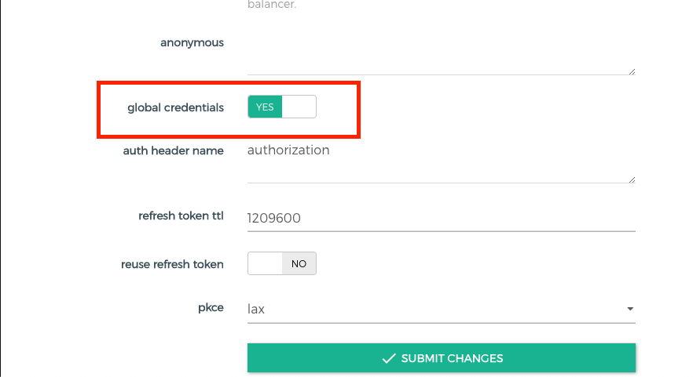

# Project description

>This project implement Kong Oauth2.0 for create own resource-server and own authorization server.

## Over view

--- 

### (1) Start with running Kong with docker following the docker compose file

    $ docker compose up

    Note! useing ports:
      - 8011:8000
      - 9443:8443 
      - 9444:8444
      - 127.0.0.1:8001:8001

(1.25) create service & route in Kong (able to using Konga) for 2  service (api-leave-App, api-profile-App) 

(1.5) add both api with Oathu2 at service

(1.75) create consumer for plugin and finally add oauth2 credentail 

### (2) start both node app (api-profile & api-leave) , api-auth is optional

    $ cd api-leave

    $ node server

    ---

    $ cd api-profile

    $ node server

### 3 request Authorize code with api

    [POST] https://localhost:7788/exchangeToken

    body: {
        "clientId": <"client_id_from_consumer">,
        "scope": <"scope_that_allow_app">,
        "provisionKey": <"provision_key_from_plugin">,
        "userId": <"value that map in resource">,
        "clientSecret": <"client_secret_from_consumer">
    }

in side /exchangToken it will be call 

- https://localhost:9443/<"service-route">/oauth2/authorize

and

- https://localhost:9443/<"service-route">/oauth2/authorize

for request authorization code and exchange for access token

5 use access token to access resource in resource-server with api

    [POST] https://localhost:9443/<service-route>/<path_that_resource-server_backend>

!!!! Note !!!!

ถ้าต้องการให้ access token ตัวเดียวสามารเข้าถึงได้่ทุก app ให้ไป config key => global credentails : true ที่ตอน config Oauth2

